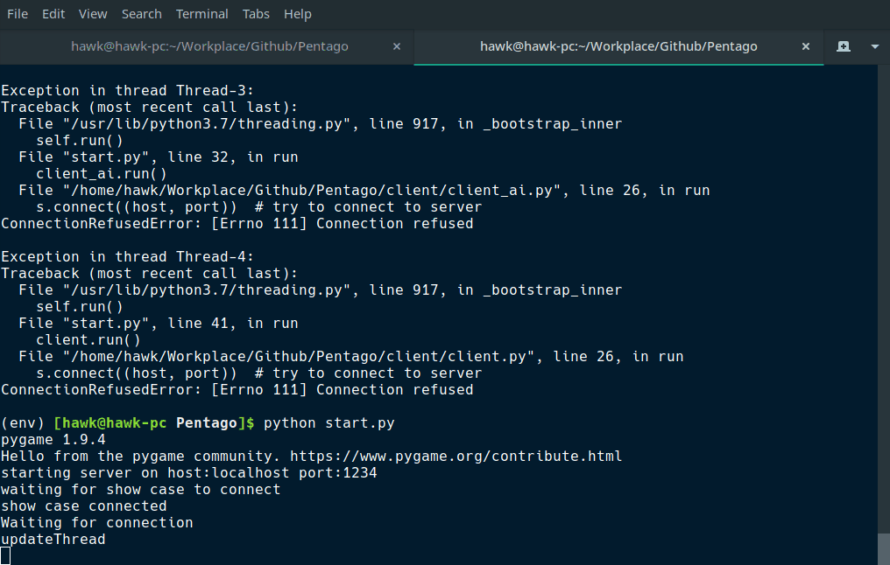

# Pentago
A pentago game client and server source code written in python.    
This game can be runned as a script in console or using a client    
server architecture connect a graphical component to the game to 
display the game.

# Dependencies
pygame     1.9.4

# Pentago in console
Check out `main_game.py` in game directory.    

# Using client server architecture
Two player clients and a graphical component can be connected to    
a server to play the game.

connection between clients and server is by socket.    
    

